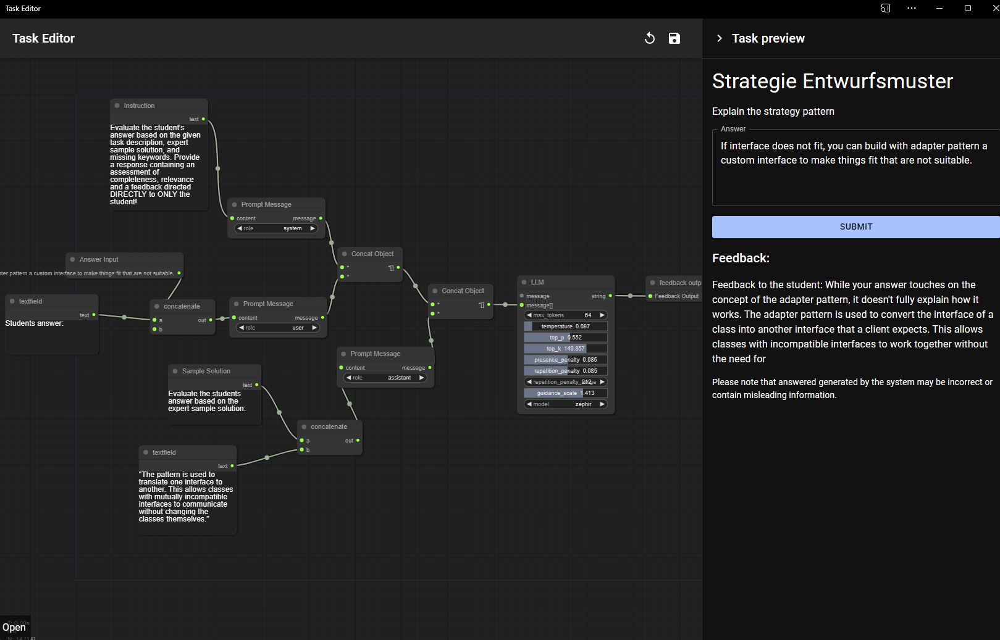

# @haski/task-evaluation

## Overview

This repository provides an app for automated task evaluation. Using an intuitive node graph interface, users can create and configure tasks, which are then evaluated by a by the system. The system consults worker units if necessary. The worker units are models hosted using the openAPI standard.

---

This mono repository, named `@haski/task-evaluation`, is designed to encompass a server, a frontend Progressive Web Application (PWA) developed in React, and a shared library package.
Created and maintained by David Fischer.



## Getting Started

### Prerequisites

- Node.js
- Yarn (Version 4.0.2 or later)

### Installation

1. Clone the repository:

   ```bash
   git clone https://github.com/HASKI-RAK/HASKI-task-evaluation.git
   ```

2. Install dependencies:
   ```bash
   yarn install
   ```
3. Run prisma migrations:
   ```bash
   yarn setup
   ```

### Running the Project

To run the project in a development environment, use the following command:

```bash
yarn dev
```

This will launch both the server and the frontend PWA in development mode.

## Structure

The project is structured into multiple workspaces located under `packages/*`, enabling seamless integration and development of the individual components.

### Server

The server component, implemented in TypeScript, provides the backend functionality for the application. It stores graph data based on the current path using [Prisma](https://www.prisma.io/), a database toolkit and Object Relational Mapper (ORM). The server also provides an API for the frontend PWA to interact with the evaluated graph in the backend using websockets.

### Frontend PWA

Developed in React, the frontend PWA offers a responsive and interactive user experience. It provides a node editor for creating and configuring tasks. Users see a form for submitting their solution to the task, which is then evaluated by the server.

### Library Package

The library package includes shared resources and utilities used across the server and the frontend PWA. These include node types and websocket message types.

## Example Usage

TODO

## Docker

TODO

## Scripts

- **Development**: `yarn dev` - Runs both the server and frontend in development mode.
- **Lint**: `yarn lint` - Lints the codebase for both the server and frontend.

## License

This project is licensed under the MIT License - see the [LICENSE](LICENSE) file for details.
